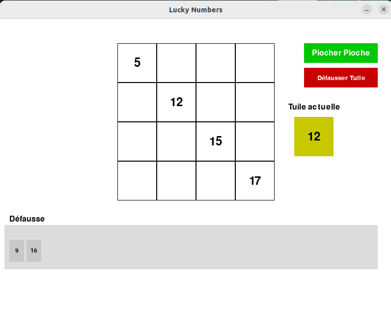

## Table of Contents

- [Introduction](#introduction)
- [User Interface](#user-interface)
- [Features](#features)
- [Reinforcement Learning](#reinforcement-learning)
- [Prerequisites](#prerequisites)


## Introduction

**Lucky Numbers** is a strategic tile-placement game developed using Pygame, designed to demonstrate the application of the Model-View-Controller (MVC) architectural pattern in combination with advanced reinforcement learning (RL) techniques. The project serves both as an academic exercise in reinforcement learning and as a showcase for sophisticated game development and AI integration. Players compete against AI agents trained using various RL algorithms, aiming to complete their 4x4 grids by strategically placing numbered tiles.
## User Interface
 <!-- Replace with actual image URL -->

## Features

- **MVC Architecture**: Clean separation between the game's data (Model), user interface (View), and control logic (Controller).
- **Graphical User Interface (GUI)**: Intuitive and responsive interface built with Pygame.
- **AI Opponents**: Compete against AI agents trained using Deep Q-Networks (DQN) and their advanced variants.
- **Deep Reinforcement Learning Integration**: Implement and evaluate multiple RL algorithms for AI decision-making.
- **Game Metrics**: Track scores, move counts, execution times, and other performance indicators.

## Reinforcement Learning

The core objective of the **Lucky Numbers** project is to implement, train, and evaluate various reinforcement learning agents. These agents utilize different RL algorithms to make strategic decisions within the game environment.

## Technologies Used
- **Python 3.7+**: [Download Python](https://www.python.org/downloads/)
- **Pygame**: For creating the graphical user interface.
- **Reinforcement Learning Libraries**:
  - **TensorFlow**
  - **Keras**

## Installation

1. **Clone the Repository**

   ```bash
   git clone https://github.com/yourusername/lucky_numbers.git
   cd lucky_numbers
